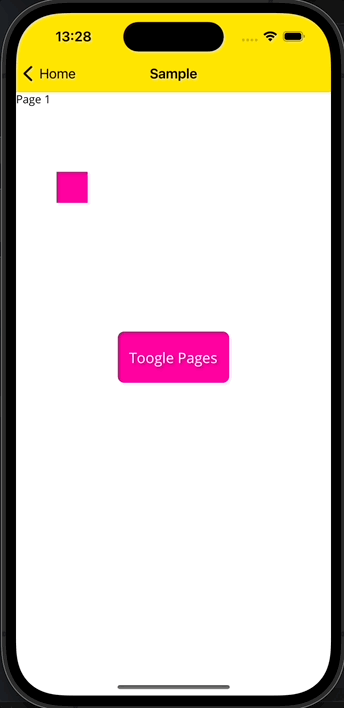
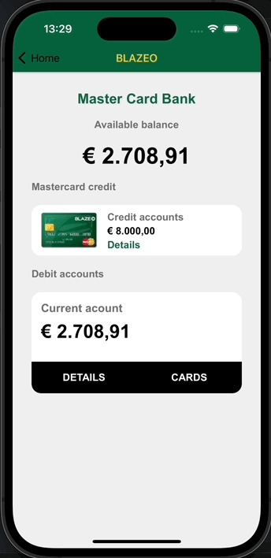
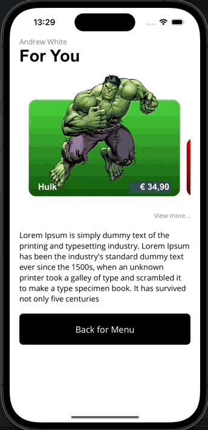

# SHARE TRANSITION MAUI
Custom Navigation with custom animation transition.
A .NET MAUI library for easily customizable animations of transitions of pages.

The library consists of one NuGet packages:

[](https://www.nuget.org/packages/ShareTransitionMaui/)

[Sample](https://github.com/pabloprogramador/ShareTransitionMaui/tree/main/ShareTransitionMaui.Sample)

To use, mark ClassId="my_square" in shared tags:
```html
<stm:ShareTransition x:Name="pgShareTransition">
            <!-- PAGE 1 -->
            <Grid>
                <Label Text="Page 1" />
                <Rectangle ClassId="my_square"
                           Grid.Row="1"
                           Margin="50"
                           VerticalOptions="Center"
                           HorizontalOptions="Start"
                           WidthRequest="40"
                           HeightRequest="40"
                           Fill="#FF00A1" />
            </Grid>
            <!-- PAGE 2 -->
            <Grid>
                <Rectangle ClassId="my_square"
                           Fill="#FFE501" />
                <Label Text="Page 2"
                       FontSize="40" />
            </Grid>
        </stm:ShareTransition>
```




|||||

